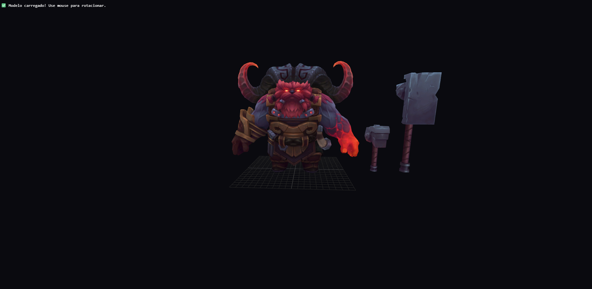
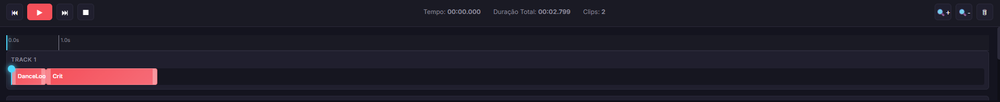
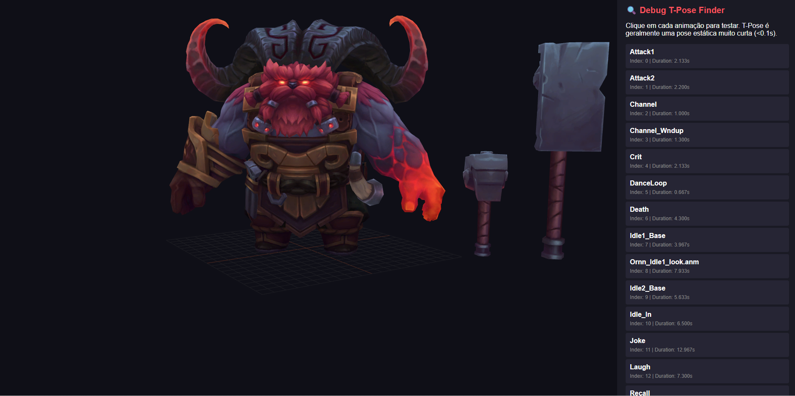

# Ornn Animation Studio

**Editor profissional de animações 3D para criação de conteúdo de streaming**

---

## Galeria


*Interface principal do editor*


*Sistema de visualização 3D em tempo real*


*Editor de timeline com múltiplas tracks*


*21 animações organizadas por categoria*

## O Problema

Criadores de conteúdo e streamers frequentemente precisam criar animações personalizadas para seus vídeos e transmissões ao vivo. Ferramentas profissionais como Blender são poderosas, mas exigem curva de aprendizado íngreme e são excessivamente complexas para tarefas simples de edição de animações pré-existentes.

**A maioria dos editores de animação não foi projetada para fluxos de trabalho rápidos.** Ou você aprende um software profissional completo durante semanas, ou fica limitado a ferramentas básicas que não oferecem controle real sobre timing e transições.

Este projeto resolve esse problema específico: um editor de animações intuitivo que permite combinar, editar e exportar sequências animadas sem complexidade desnecessária.

---

## Como Funciona

### Visualização 3D em Tempo Real

O viewport 3D mostra o personagem Ornn com controles intuitivos de câmera. Rotacione, dê zoom e navegue livremente pelo modelo enquanto trabalha.

- **Controles de mouse**: Rotacionar (arrastar), zoom (scroll), pan (botão direito)
- **Qualidade profissional**: Renderização com Three.js, sombras e iluminação dinâmica
- **Preview instantâneo**: Veja suas animações rodando em tempo real

### Biblioteca de Animações

21 animações completas prontas para usar, organizadas por categoria:

**Combate**
- Attack1, Attack2, Crit

**Habilidades**
- Spell1 (Q), Spell2 (W), Spell3 (E), Spell4 (R)
- Channel, Channel_Windup

**Sociais**
- Dance, Laugh, Taunt

**Movimentação**
- Run, Idle, Spawn, Death, Recall

Um clique para preview, duplo clique para adicionar à timeline. Simples assim.

### Timeline Profissional

Sistema de edição não-destrutiva com 3 tracks paralelas:

- **Arraste e solte**: Posicione animações visualmente
- **Redimensione clips**: Ajuste durações com handles intuitivos
- **Divida clips**: Tecla X para split no playhead
- **Navegação precisa**: Playhead sincronizado, régua de tempo, marcadores

### Controle de Transições

Ajuste fino de como uma animação flui para a próxima:

- **Duration**: 0.05s - 2.0s (controle de quanto tempo leva a transição)
- **Easing**: Linear, Ease-In, Ease-Out, Ease-In-Out (curva de suavização)
- **Blend Mode**: Crossfade (padrão) ou Additive (efeitos especiais)

Todas as transições acontecem automaticamente. Configure uma vez, o sistema cuida do resto.

### Sistema de Salvamento

Trabalhe com confiança sabendo que seu progresso está protegido:

- **Auto-save**: Salvamento automático a cada 30 segundos
- **LocalStorage**: Projetos salvos localmente no navegador
- **Export JSON**: Download de projetos para backup ou compartilhamento
- **Histórico**: Até 10 projetos salvos automaticamente

### Controles de Viewport

Ferramentas visuais para diferentes necessidades:

- **Wireframe**: Visualize a geometria do modelo
- **Skeleton**: Veja o rig de ossos durante animações
- **Grid**: Grade de referência para posicionamento
- **Reset**: Volte à posição inicial da câmera
- **Background**: Escolha qualquer cor de fundo

### Model Parts

Controle de visibilidade por parte do modelo:

- Lista todas as meshes do personagem
- Mostre/oculte partes individuais
- Útil para foco em detalhes específicos

---

## Sobre o Projeto

### Criado Para o Streamer bodescorp

Este editor foi desenvolvido como MVP para facilitar a criação de conteúdo animado do streamer **bodescorp**. O objetivo é permitir que criadores de conteúdo produzam animações personalizadas rapidamente, sem precisar dominar software 3D complexo.

**Links do Streamer:**
- [bodescorp Stream](https://alttabcorp.github.io/bodescorp_stream/)
- Widget de streaming interativo com animações do Ornn

### Modelos 3D

Os modelos 3D utilizados foram obtidos através do [Model Viewer](https://modelviewer.lol/), uma excelente fonte de modelos de personagens de League of Legends com animações completas.

---

## Interface Intuitiva

### Atalhos de Teclado

| Tecla | Ação |
|-------|------|
| **Espaço** | Play/Pause |
| **←/→** | Frame anterior/próximo |
| **Delete** | Remover clip selecionado |
| **X** | Dividir clip no playhead |
| **Ctrl+S** | Salvar projeto |

### Workflow Rápido

1. **Escolha animações** da biblioteca (click para preview)
2. **Adicione à timeline** (duplo click ou botão +)
3. **Ajuste timing** (arraste clips e bordas)
4. **Configure transições** no painel lateral
5. **Dê play** para visualizar o resultado
6. **Salve** seu trabalho

### Feedback Visual

- Clips selecionados ficam destacados em azul
- Playhead mostra exatamente onde você está
- FPS counter mostra performance em tempo real
- Display de animação atual sempre visível

---

## Tecnologia

**Progressive Web App**
- Funciona direto no navegador (Chrome, Firefox, Edge)
- Sem instalação necessária
- Performance nativa com WebGL

**Tecnologias Utilizadas**
- **Three.js**: Renderização 3D de alta qualidade
- **JavaScript ES6+**: Código modular e organizado
- **CSS Grid**: Layout profissional responsivo
- **Web APIs**: LocalStorage para persistência

**Arquitetura Modular**

O projeto é dividido em 3 módulos principais:

```
src/js/
├── animation-system.js    # Sistema 3D (Three.js, GLTFLoader, OrbitControls)
├── timeline-editor.js     # Editor de timeline com clips e tracks
└── app-pro.js            # Controlador principal da aplicação
```

Cada módulo tem responsabilidade clara e pode ser entendido independentemente.

---

## Executar Localmente

```bash
# Qualquer servidor HTTP funciona
python3 -m http.server 8080

# Acesse em http://localhost:8080
```

Ou use a extensão Live Server do VS Code para desenvolvimento com hot reload.

### Estrutura de Arquivos

```
Ornn_edit/
├── index.html              # Interface principal
├── assets/
│   └── models/
│       └── ornn.glb       # Modelo 3D com 21 animações
└── src/
    ├── css/
    │   └── styles-pro.css # Sistema completo de design
    └── js/
        ├── animation-system.js   # Sistema 3D
        ├── timeline-editor.js    # Editor de timeline
        └── app-pro.js            # Controlador principal
```

---

## Casos de Uso

### Para Streamers
- Crie intro/outro animadas personalizadas
- Prepare transições entre cenas
- Gere conteúdo para alertas de sub/follow
- Produza shorts/reels com animações

### Para Criadores de Conteúdo
- Monte sequências de combos e habilidades
- Exporte animações para edição de vídeo
- Teste timings de animações antes de gravar
- Crie material de referência visual

### Para Designers
- Explore animações do personagem
- Teste transições e easing
- Visualize skeleton e wireframe
- Exporte configurações para outras ferramentas

---

## Funcionalidades Implementadas

**Core**
- Sistema de animação 3D com Three.js
- 21 animações completas do modelo
- Viewport com controles de câmera profissionais
- Timeline com 3 tracks paralelas

**Edição**
- Drag & Drop de clips
- Redimensionamento visual de duração
- Split de clips (tecla X)
- Delete de clips (tecla Delete)
- Playhead sincronizado
- Zoom in/out na timeline

**Transições**
- Controle de duração (0.05s - 2.0s)
- Múltiplos easings (linear, ease-in, ease-out, smooth)
- Blend modes (crossfade, additive)
- Preview em tempo real

**Salvamento**
- Auto-save a cada 30s
- LocalStorage persistente
- Export/Import JSON
- Histórico de projetos

**Visualização**
- Wireframe mode
- Skeleton helper
- Grid toggle
- Background color picker
- Model parts visibility
- FPS counter

**Controles**
- Play/Pause (com resume correto)
- Stop (reset para 0)
- Navegação frame a frame
- Atalhos de teclado
- Reset de câmera

---

## Status do Projeto

**Versão**: 1.0 (MVP)  
**Status**: Funcional e pronto para uso  
**Última atualização**: Janeiro 2026

---


## Reflexões

Este projeto nasceu da necessidade real de criar conteúdo animado de forma rápida e acessível. Ao invés de se adaptar a ferramentas genéricas ou aprender software profissional complexo, construímos exatamente o que era necessário.

O resultado é uma ferramenta especializada que resolve um problema específico muito bem. Não tenta ser o Blender ou o After Effects. É um editor focado em combinar animações existentes de forma intuitiva e rápida.

Perfeito? Não. Funcional? Absolutamente. Útil para streamers e criadores de conteúdo? Esse é o objetivo.

---

## Créditos

**Modelos 3D**: [Model Viewer](https://modelviewer.lol/)  
**Streamer**: [bodescorp](https://alttabcorp.github.io/bodescorp_stream/)  
**Tecnologia**: Three.js, JavaScript ES6+, CSS Grid  

---

**Alttabcorp** © 2025
